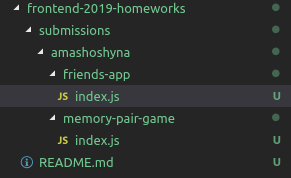

#  Frontend 2019 course homeworks
This repo was created for students to submit their homeworks for review. 

### How to submit
- fork this repo
- in your fork, add folder with your github name under  `submissions` (if you haven't yet)
- in your fork, add a folder with task name and put your code in the folder
- make pull-request to this repository to add your changes.
- Assign course mentors to review your pull-request
- If necessary, make changes, until your code will be approved and merged.

See file structure below:

